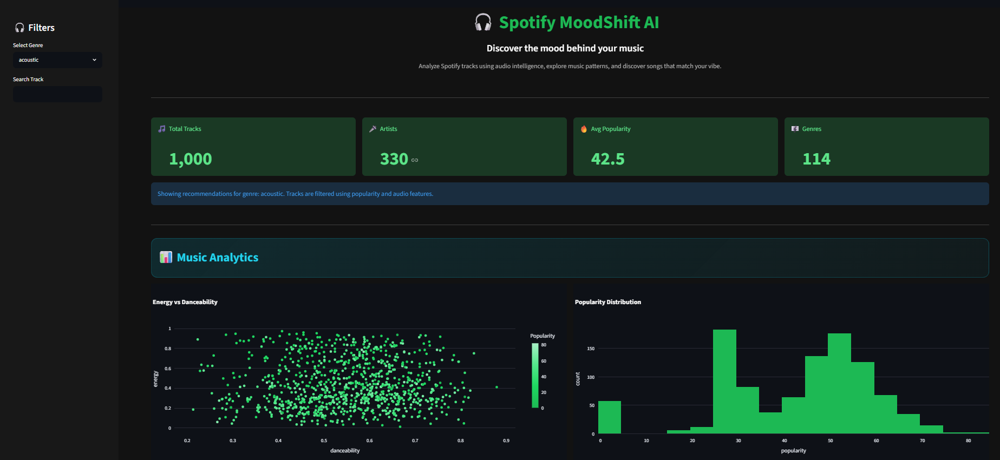
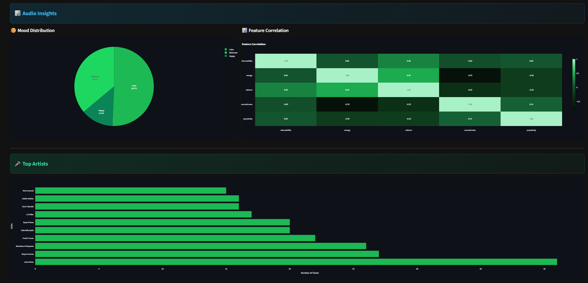
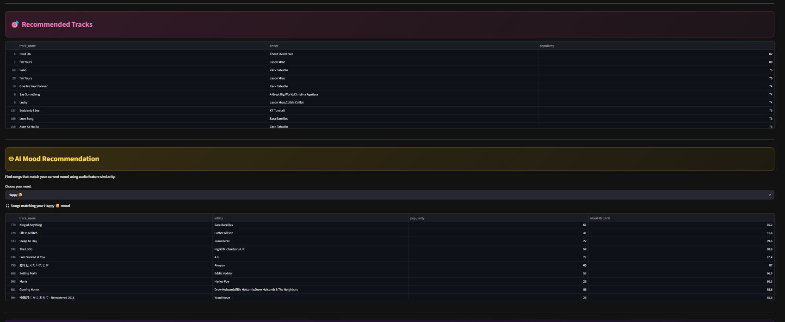
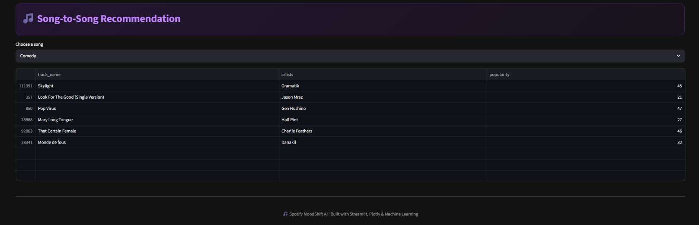

# 🎧 Spotify MoodShift AI

An interactive music analytics and recommendation dashboard built with Streamlit, Plotly, and Machine Learning.

Spotify MoodShift AI helps users explore music patterns, analyze audio features, discover mood-based recommendations, and find similar songs using content-based filtering techniques.

---

## 🚀 Features

### 📊 Music Analytics
- Energy vs Danceability analysis
- Popularity distribution visualization
- Interactive Plotly charts

### 🎼 Audio Insights
- Mood distribution analysis
- Feature correlation heatmap
- Audio feature exploration

### 🎤 Artist Analytics
- Top artists by track count
- Genre-based filtering

### 🎯 Recommended Tracks
- Popular tracks within selected genres
- Dynamic filtering

### 🤖 AI Mood Recommendation
- Mood-based song recommendations
- Similarity scoring using audio features

### 🎵 Song-to-Song Recommendation
- Content-based recommendation engine
- Find songs similar to a selected track

---

## 🖼️ Dashboard Preview

### Home Dashboard



### Audio Insights



### Recommendations



### Song-to-Song Recommendation



---

## 🛠️ Technologies Used

- Python
- Streamlit
- Pandas
- Plotly Express
- Scikit-Learn
- Machine Learning
- Nearest Neighbors Algorithm

---

## 📂 Project Structure

```text
Spotify-MoodShift-AI/
│
├── app.py
├── recommender.py
├── dataset.csv
├── requirements.txt
├── README.md
│
└── images/
    ├── dashboard_home.png
    ├── audio_insights.png
    ├── recommendations.png
    └── song_recommendation.png
```

---

## ⚙️ Installation

Clone the repository:

```bash
git clone https://github.com/yourusername/Spotify-MoodShift-AI.git
cd Spotify-MoodShift-AI
```

Install dependencies:

```bash
pip install -r requirements.txt
```

Run the application:

```bash
streamlit run app.py
```

---

## 🎯 Machine Learning Approach

The recommendation engine uses:

- Feature scaling with StandardScaler
- Content-based filtering
- K-Nearest Neighbors (KNN)
- Audio feature similarity matching

Audio features used include:

- Danceability
- Energy
- Valence
- Acousticness
- Popularity

---

## 📈 Future Improvements

- Spotify API integration
- Playlist recommendations
- User authentication
- Real-time music analytics
- Music mood prediction using classification models

---

## 👨‍💻 Author | Prativa Ghosh

Built as a Machine Learning & Data Analytics project using Streamlit and Plotly.

🎵 Spotify MoodShift AI | Built with Streamlit, Plotly & Machine Learning
